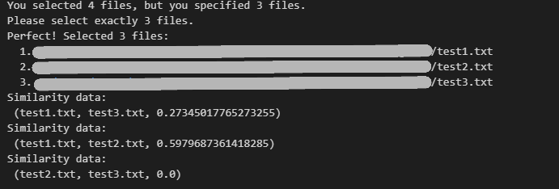

# Similarity Check

This project is a Python-based text similarity analyzer that compares multiple text files using TF-IDF vectorization and cosine similarity. Perfect for detecting plagiarism, comparing documents, or analyzing text similarity.

## Features

- Compare multiple text files simultaneously
- Interactive file selection with GUI dialog
- TF-IDF (Term Frequency-Inverse Document Frequency) vectorization
- Cosine similarity calculation for accurate comparison
- Batch upload support for multiple files
- Detailed similarity scores between all file pairs

## How It Works

1. **Input**: Specify the number of files you want to compare
2. **Upload**: Select your text files using the file dialog
3. **Analysis**: The tool processes files using TF-IDF vectorization
4. **Results**: View similarity scores between all file combinations

## Similarity Algorithm

The tool uses:
- **TF-IDF Vectorization**: Converts text into numerical vectors based on term frequency and inverse document frequency
- **Cosine Similarity**: Measures the cosine of the angle between two vectors (0 = completely different, 1 = identical)

## Requirements

- Python 3.x
- Jupyter Notebook
- scikit-learn
- tkinter (usually included with Python)

Install dependencies:
```bash
pip install scikit-learn
```

## Usage

1. Open `similaritytest.ipynb` in Jupyter Notebook.
2. Run the notebook cell to start the similarity checker.
3. Enter the number of files you want to compare.
4. Select your text files using the file dialog.
5. View the similarity scores between all file pairs.

## Example Output



Higher scores indicate greater similarity between texts.

---

Analyze text similarity with machine learning precision!
